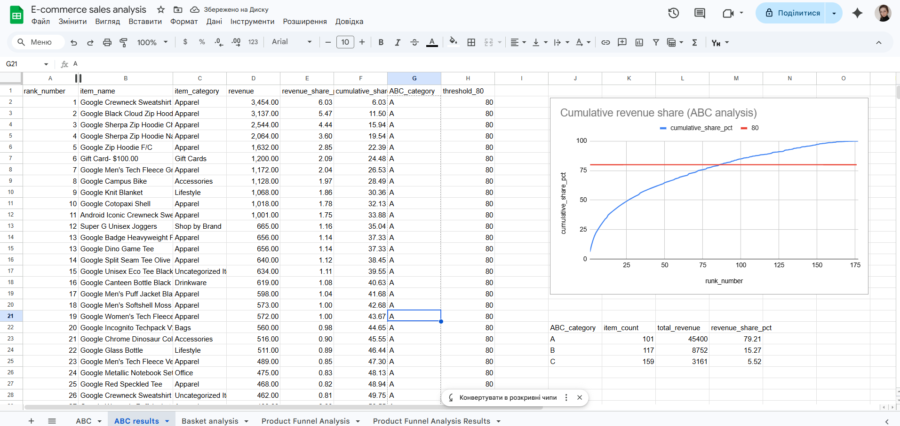

## ga4-ecommerce-analysis
SQL analysis of GA4 e-commerce data in BigQuery: product funnel, ABC segmentation, basket analysis, and user behavior insights.
## Technologies
- SQL
- BigQuery
- Google Analytics 4 sample ecommerce dataset
- Google Sheets

## SQL techniques used
- CTE
- Window Functions
- UNNEST
- CASE WHEN
- SAFE_DIVIDE
- Self Join
- Aggregations

Метою проєкту було дослідити аналіз товарного асортименту та купівельної поведінки користувачів на основі GA4 e-commerce датасету (BigQuery). Включає ABC-аналіз, basket analysis та продуктову воронку.

## 1. ABC-аналіз товарного асортименту

У цьому блоці проведено аналіз продажів на основі GA4 e-commerce dataset.

Мета аналізу — визначити товари, які формують основну частину виручки, та розподілити їх за ABC-категоріями.

Для аналізу використано:
- таблиці `ga4_obfuscated_sample_ecommerce.events_*` у BigQuery;
- події `purchase`;
- масив `items`, розгорнутий за допомогою `UNNEST(items)`.

Основні кроки:
- розрахунок виручки по кожному товару;
- ранжування товарів за виручкою;
- розрахунок частки товару в загальній виручці;
- розрахунок накопичувальної частки виручки;
- присвоєння ABC-категорії.

Для класифікації використано принцип Парето: товари категорії A формують основну частину виручки (~80%).

## Висновки
- Близько 27% товарів формують ~79% загальної виручки, що відповідає принципу Парето.
- Найбільший внесок у виручку забезпечують товари категорії `Apparel`, що свідчить про високу концентрацію попиту в цьому сегменті.
- Значна частина асортименту (група C) має мінімальний внесок у дохід (~5%), що може вказувати на потенціал для оптимізації асортименту або перегляду стратегії продажів для цих товарів.

